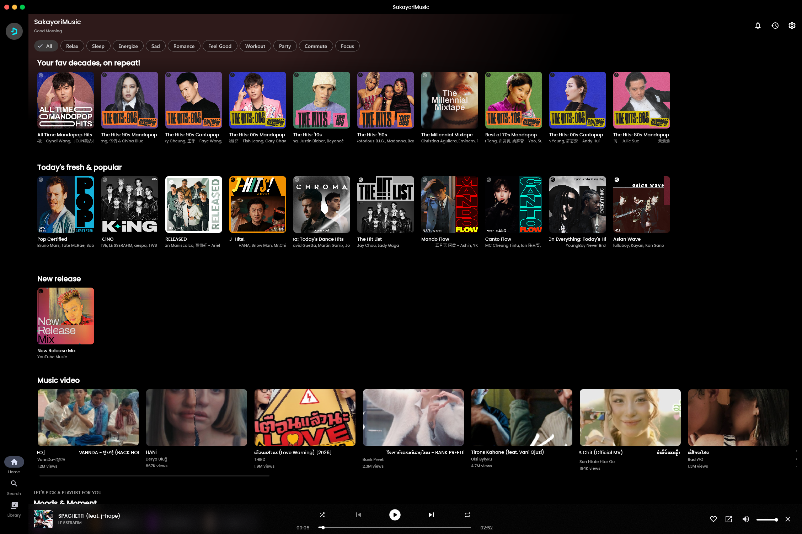
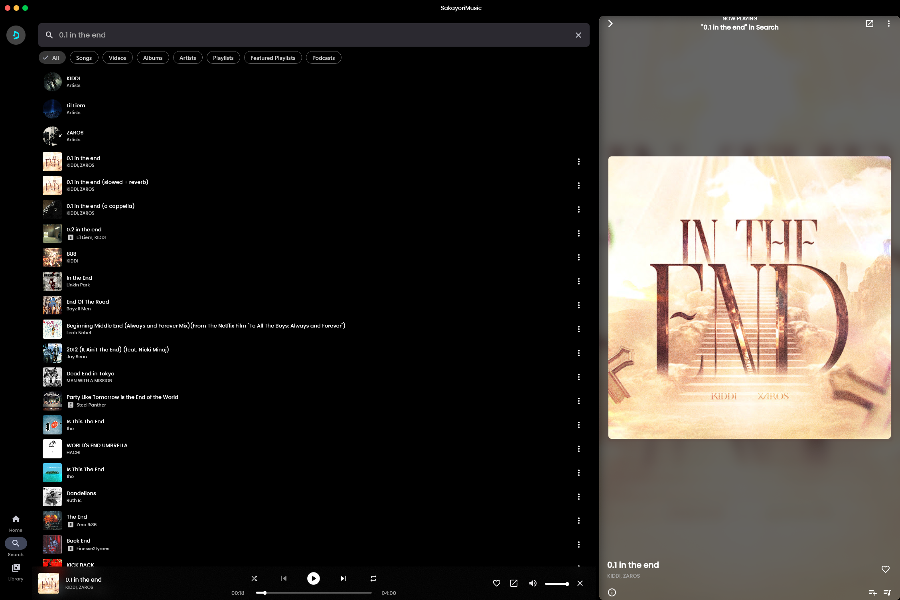
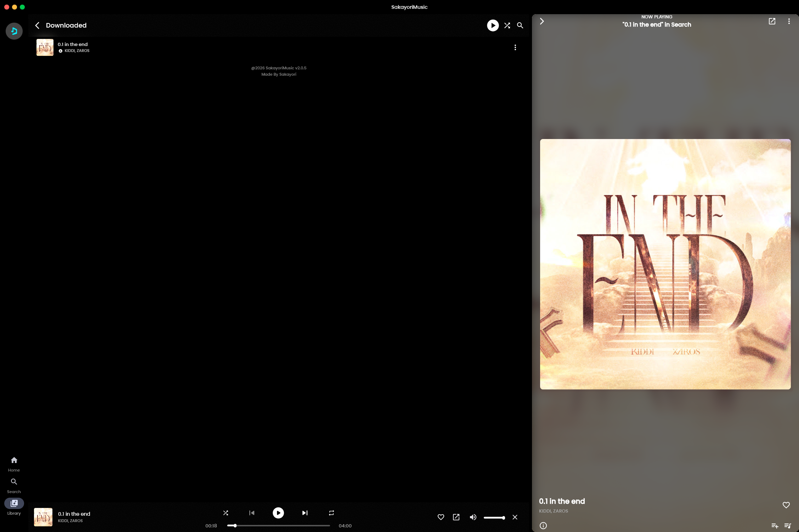
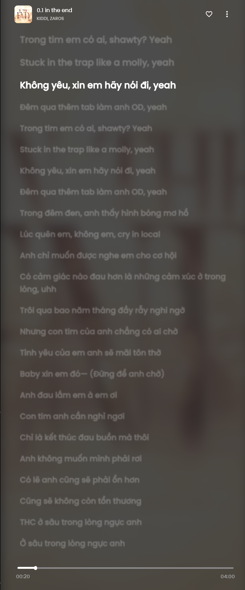
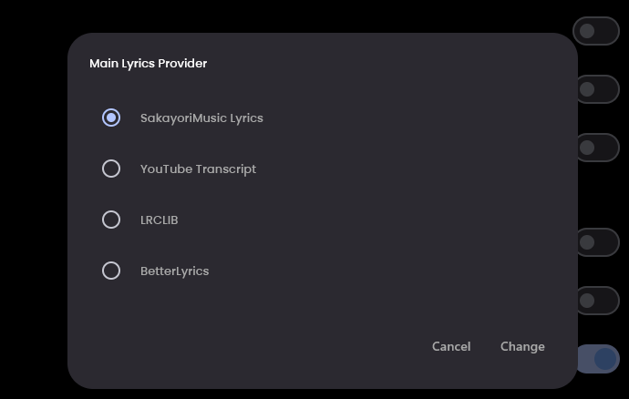
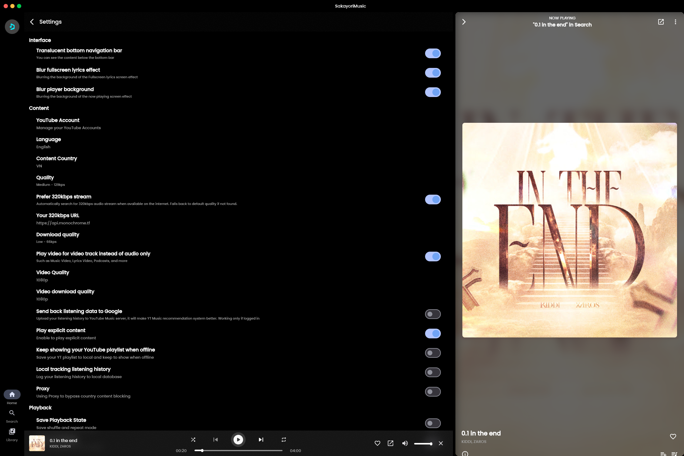

<div align="center">


# SakayoriMusic

**A modern, cross-platform YouTube Music client built with Kotlin Multiplatform & Compose**

[](https://github.com/Sakayorii/sakayori-music/releases/latest)

[](LICENSE)

[Download](#download) · [Features](#features) · [Screenshots](#screenshots) · [Build](#build) · [Credits](#credits)

**English** · [Tiếng Việt](docs/README.vi.md) · [日本語](docs/README.ja.md)

</div>

---

## About

SakayoriMusic is a free and open-source music streaming client that brings the YouTube Music experience to multiple platforms. Originally rebuilt from SimpMusic 1.1.0, it has evolved into a modernized, performant, and feature-rich music player with native support for both mobile and desktop.

## Features

- **Stream music** from YouTube Music with full library access
- **Cross-platform** support for Android and Windows desktop
- **Liquid Glass UI** with native macOS-style design on desktop
- **Built-in lyrics** with synced rich-sync support
- **Discord Rich Presence** integration
- **Spotify Canvas** background videos
- **Local playlists** and offline downloads
- **Sleep timer** and crossfade
- **Multi-language** support (20+ languages)
- **Backup & restore** your data
- **Mini player** mode for desktop multitasking
- **Android Auto** and Wear OS notifications support
- **No ads, no tracking, no telemetry**

## Screenshots

<div align="center">

### Home & Discovery


### Search & Now Playing


### Offline Library
*Listen to your favorite tracks anywhere — no internet required.*


### Real-Time Synced Lyrics
*Word-by-word rich-sync lyrics that follow along as you listen.*


### Multi-Source Lyrics System
*Choose from multiple lyrics providers — SakayoriMusic Lyrics, YouTube Transcript, LRCLIB, BetterLyrics.*


### Settings


</div>

## Download

Download the latest release from the [Releases page](https://github.com/Sakayorii/sakayori-music/releases/latest).

| Platform | Format | Description |
|----------|--------|-------------|
| **Android** | `.apk` | Universal APK for all devices |
| **Windows** | `.msi` / `.exe` | Installer with GUI setup wizard |
| **Linux** | `.deb` / `.rpm` | Debian/Ubuntu and Fedora/RHEL packages |
| **macOS** | `.dmg` | Apple Silicon and Intel builds |

### Windows Installation Note

When running the installer for the first time, Windows SmartScreen may show a warning because the app is not signed with an Extended Validation certificate. To proceed:

1. Click **More info**
2. Click **Run anyway**

This is normal for unsigned open-source applications.

## Supported Platforms

- **Android** 8.0 (API 26) and above
- **Windows** 10 / 11 (x64)
- **Linux** Ubuntu 20.04+, Fedora 34+, or equivalent (x64)
- **macOS** 11.0 Big Sur and above (Intel + Apple Silicon)

## Build

### Requirements

- JDK 21 or newer
- Android SDK 36
- Gradle 8.14+

### Build commands

```bash
git clone https://github.com/Sakayorii/sakayori-music.git
cd sakayori-music

./gradlew vlcSetup

./gradlew androidApp:assembleRelease

./gradlew composeApp:packageExe composeApp:packageMsi
```

### Output locations

| Format | Path |
|--------|------|
| APK | `androidApp/build/outputs/apk/release/` |
| EXE | `composeApp/build/compose/binaries/main/exe/` |
| MSI | `composeApp/build/compose/binaries/main/msi/` |

## Tech Stack

- **Kotlin Multiplatform** for shared code
- **Jetpack Compose** & **Compose Multiplatform** for UI
- **Koin** for dependency injection
- **Room** for local database
- **Media3 ExoPlayer** for Android playback
- **VLC** (vlcj) for desktop playback
- **Ktor** for networking
- **Coil** for image loading
- **KCEF** for desktop WebView
- **Sentry** for crash reporting

## Project Structure

```
sakayori-music/
├── androidApp/              Android application
├── composeApp/              Multiplatform Compose UI
│   ├── commonMain/          Shared UI code
│   ├── androidMain/         Android-specific
│   └── jvmMain/             Desktop-specific
├── core/
│   ├── common/              Shared utilities
│   ├── domain/              Domain layer (entities, interfaces)
│   ├── data/                Data layer (repositories, database)
│   ├── media/               Media playback (Media3, VLC)
│   └── service/             External services (YouTube, Spotify, etc.)
└── crashlytics/             Sentry integration
```

## Credits

- **Original project:** [SimpMusic](https://github.com/maxrave-dev/SimpMusic) by maxrave-dev
- **Maintained by:** [Sakayorii](https://github.com/Sakayorii)

## License

Copyright © 2026 **Sakayori Studio**.

Licensed under the [MIT License](LICENSE) — free to use, modify, distribute, and build upon. No permission required.

## Disclaimer

SakayoriMusic is not affiliated with, endorsed by, or sponsored by Google, YouTube, or Spotify. All trademarks, service marks, trade names, product names and logos appearing on the app are the property of their respective owners.
